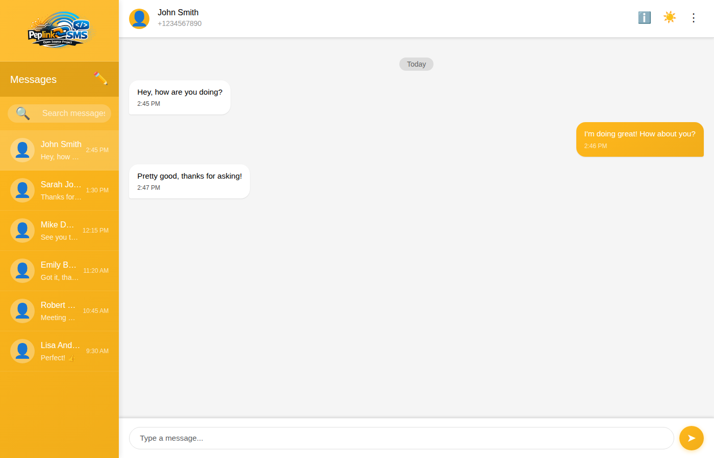

<div align="center">
  
</div>

# Peplink-SMS

An Open Source Responsive WebUI for sending and receiving SMS thru Peplink

**IMPORTANT NOTE:** I built this software myself as I wanted to send and receive SMS over Peplink without needing the stock UI to do so. **I am not associated with Peplink in any way, shape, or form, at the time of this writing.**

> If this project keeps your Peplink SMS workflows running smoothly, consider tossing a donation toward hosting, hardware, and future features—thanks for helping the project grow!
>
> - [**Donate via PayPal**](https://www.paypal.com/donate/?hosted_button_id=EHQUAKSBLUD9C)
> - BTC: `3D7wQyEyH8RPUbq2NSZPMobgz6wjenZGM1`
> - ETH / ERC-20: `0xe48F3160f442436578de146ADFd635Ff622Dff77`

## Requirements

- A Peplink Router running v8.0.0 or higher
- A Linux/MacOS/FreeBSD/Windows device capable of running nodeJS or nodeJS+Docker
- Clear local traffic path between the Peplink router's port 80/443 and the server running Peplink-SMS (A Raspberry Pi on the Peplink's LAN, with Zerotier or Tailscale for remote access to the Pi would work fine for this)

## Bootstrap Frontend




## Installation

Clone once, then pick your preferred runtime. Docker Compose is the quickest path since it builds the backend and serves the UI in one container.

```bash
git clone https://github.com/JackPala/Peplink-SMS.git
cd Peplink-SMS
```

### Docker Compose (recommended)

```bash
docker compose up --build
```

This builds the Node backend, serves the Bootstrap UI, and keeps SQLite data under `app/data` on your host. Browse to http://localhost:3000 (or set `PORT`/`VIRTUAL_HOST` if needed).

### Local Node / npm

```bash
cd app
npm install
npm run dev   # or: npm start for production
```

The Express server listens on http://localhost:3000 by default. SQLite data lives in `app/data/peplink_sms.db`.

## Usage

- Visit http://localhost:3000. If the SQLite database has no setup entry, you'll be redirected to `/setup` to enter the required Peplink + login credentials.
- After submitting the form, the app stores the router info plus a hashed login password, then challenges you with HTTP Basic Auth. Use the same username/password you just created.
- Once authenticated you land on the messaging UI (`index.html`). Use the ⋮ menu’s Logout option to terminate the HTTP Basic session (browser will show the login prompt again).
- Health checks live at `/health`, and your saved metadata (sans passwords) can be viewed with an authenticated call to `/api/settings`.

## App API

All API calls are protected by HTTP Basic Auth using the username/password you configured during setup. The examples below assume the app is running on `http://localhost:3000` and that your credentials are `admin:changeme`.

### List All Conversations / Messages

`GET /api/sms` fetches all stored conversations. By default, the backend first syncs with the router, then returns JSON shaped like:

```bash
curl -u admin:changeme http://localhost:3000/api/sms
```

Response (truncated):

```json
{
  "conversations": [
    {
      "sender": "+16152639394",
      "latestTimestamp": 1734138260,
      "messages": [
        {
          "id": 42,
          "connId": 6,
          "timestamp": 1734138260,
          "direction": "received",
          "content": "Hey..."
        }
      ]
    }
  ],
  "syncSummary": { "connectionsChecked": 1, "messagesStored": 20 },
  "syncError": null,
  "syncTimestamp": "2024-12-14T01:24:20.123Z"
}
```

To return cached data without polling the router again, add `refresh=false`:

```bash
curl -u admin:changeme "http://localhost:3000/api/sms?refresh=false"
```

### List Messages for a Specific Phone Number

There is no dedicated endpoint per contact; instead request `/api/sms` and filter the `conversations` array client-side. For example, using `jq`:

```bash
curl -u admin:changeme http://localhost:3000/api/sms \
  | jq '.conversations[] | select(.sender == "+16152639394")'
```

This returns only the conversation object whose `sender` matches the target phone number.

### Send a Message

`POST /api/sms/send` sends an outbound SMS via the Peplink router. Required JSON fields:

- `recipient`: phone number in `+E164` format (e.g. `+16152639394`)
- `content`: message body
- `connId` (optional): specific WAN connection ID to use; omit to auto-select

Example:

```bash
curl -u admin:changeme \
  -H "Content-Type: application/json" \
  -d '{"recipient":"+16152639394","content":"Test from curl","connId":6}' \
  http://localhost:3000/api/sms/send
```

Successful requests return `{"message":"SMS sent successfully.","details":{"connId":6,"sentAt":"..."}}`. Any error text from the router will be surfaced in the `message` field.
